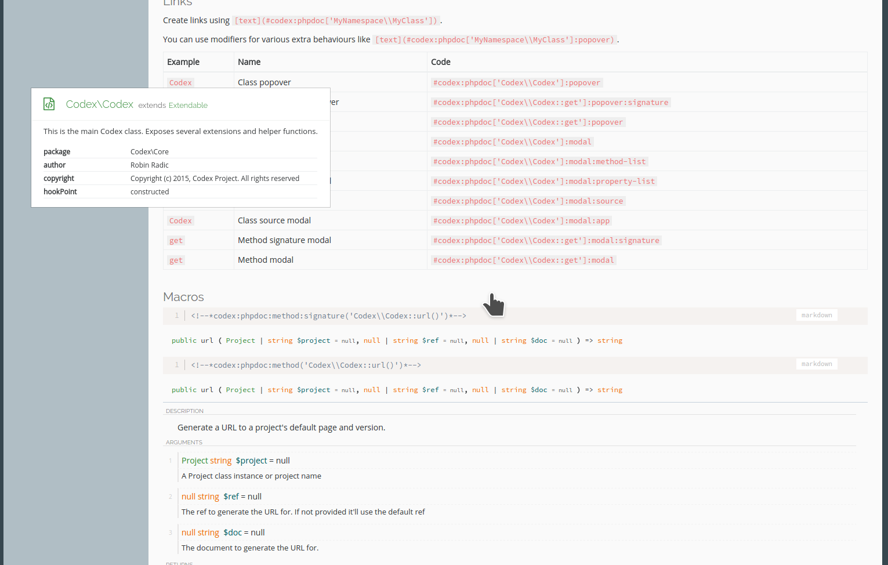
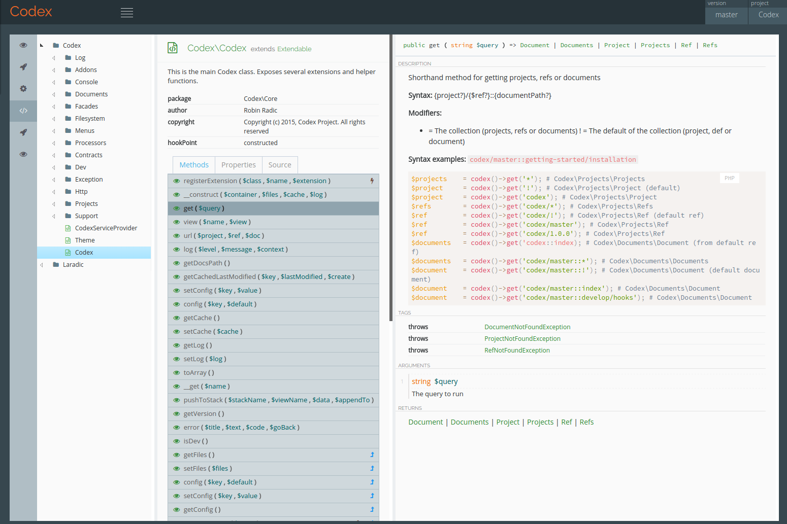

Codex Phpdoc Addon
==================

Go to the [main Codex repository](https://github.com/codex-project/codex).

The Phpdoc Addon provides Codex the means to parse the phpdoc generated xml file and display it in a user-friendly way.

The package follows the FIG standards PSR-1, PSR-2, and PSR-4 to ensure a high level of interoperability between shared PHP code.

Documentation
-------------

Check out the [official documentation](http://codex-project.ninja).

Preview
-------
**In a document:**

**In API Documenation**

License
-------
Copyright (c) 2015 Robin Radic, [MIT License](LICENSE.md)
